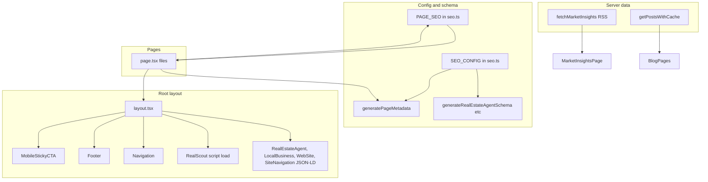

# Architecture and route map (Artifact)

Reference for adding new pages or refactoring. No code edits—structure and ownership only.

---

## App Router map (main routes)

| Route | Purpose | Layout |
|-------|---------|--------|
| `/` | Homepage | Root |
| `/about`, `/about/team`, `/about/partners` | About | Root |
| `/contact` | Contact | Root |
| `/team` | Team | Root |
| `/buying`, `/buying/updates` | Buying | Root |
| `/selling`, `/selling/luxury` | Selling | Root |
| `/services`, `/services/estate-management` | Services | Root |
| `/luxury`, `/luxury/communities`, `/luxury/rentals`, `/luxury/land`, `/luxury/condos`, `/luxury/developments`, `/luxury/investment`, `/luxury/commercial`, `/luxury/virtual-tours` | Luxury | Root |
| `/investing` | Investing | Root |
| `/home-value` | Home value widget | Root |
| `/cash-offer` | Cash offer program | Root |
| `/why-list-with-us` | Why list | Root |
| `/listings`, `/listings/search` | Listings | Root |
| `/sold-listings` | Sold | Root |
| `/areas/summerlin`, `/areas/henderson`, `/areas/north-las-vegas`, `/areas/downtown`, `/areas/green-valley` | Area pages | Root |
| `/communities` | Communities hub | Root |
| `/buyer-guide`, `/seller-guide`, `/first-time-buyer-challenges` | Guides | Root |
| `/assessments/buyer-readiness`, `/assessments/seller-readiness` | Assessments | Root |
| `/market-insights`, `/market-insights/full` | Market insights | Root |
| `/blog`, `/blog/[slug]`, `/blog/category/[slug]` | Blog | Root |
| `/resources`, `/reports` | Resources | Root |
| `/exclusive/*`, `/press/*`, `/vendors` | Other | Root |

All pages use the single root layout (`src/app/layout.tsx`).

---

## Data flow

- **Metadata/schema:** `src/lib/seo.ts` — `SEO_CONFIG`, `PAGE_SEO`, `generatePageMetadata()`, `generateRealEstateAgentSchema()`, `generateLocalBusinessSchema()`, `generateWebSiteSchema()`, `generateSiteNavigationElementSchema()`.
- **Layout:** Injects RealEstateAgent, LocalBusiness, WebSite, SiteNavigation JSON-LD; loads RealScout script once; renders Navigation, Footer, MobileStickyCTA.
- **Server data:** Market insights from `fetchMarketInsights()` (RSS); blog from `getPostsWithCache()` / blog categories.

---

## Component ownership (NAP, CTAs, schema)

| Concern | Where it lives |
|---------|----------------|
| **NAP (visible)** | Footer (`src/components/Globals/Footer/Footer.tsx`), Contact page, any NAP blocks in content. |
| **Primary CTA (702-222-1964)** | `SEO_CONFIG.phone` in `src/lib/seo.ts`; `MobileStickyCTA`, `StandardCTA`, `ConsultationCTA`, Navigation, Footer, and page-level CTAs. Use `tel:702-222-1964` and `sms:702-222-1964`. |
| **Schema (JSON-LD)** | Root layout: RealEstateAgent, LocalBusiness, WebSite, SiteNavigationElement. Page-level breadcrumbs/FAQ via `generateBreadcrumbSchema()` and page-specific schema where used. |
| **RealScout** | Script loaded once in `layout.tsx` (`em.realscout.com/widgets/...`). Widgets: `RealScoutListings`, `PropertyListingsSection`, `SummerlinListings`, `HomeValueWidget` (realscout-home-value, realscout-office-listings, etc.). |

When adding or changing NAP, CTA, or schema, update the single source (`SEO_CONFIG` or schema helpers) and the components listed above so the site stays consistent.

---

## File reference

| Area | Path |
|------|------|
| App routes | `src/app/**/page.tsx` |
| Root layout | `src/app/layout.tsx` |
| SEO config and schema | `src/lib/seo.ts` |
| Sitemap | `src/app/sitemap.ts` |
| Navigation / Footer | `src/components/Globals/Navigation/`, `src/components/Globals/Footer/` |
| CTAs | `src/components/ui/MobileStickyCTA.tsx`, `StandardCTA.tsx`, `ConsultationCTA.tsx` |
| RealScout | `src/components/Home/RealScoutListings.tsx`, `PropertyListingsSection.tsx`, `HomeValueWidget.tsx` |
